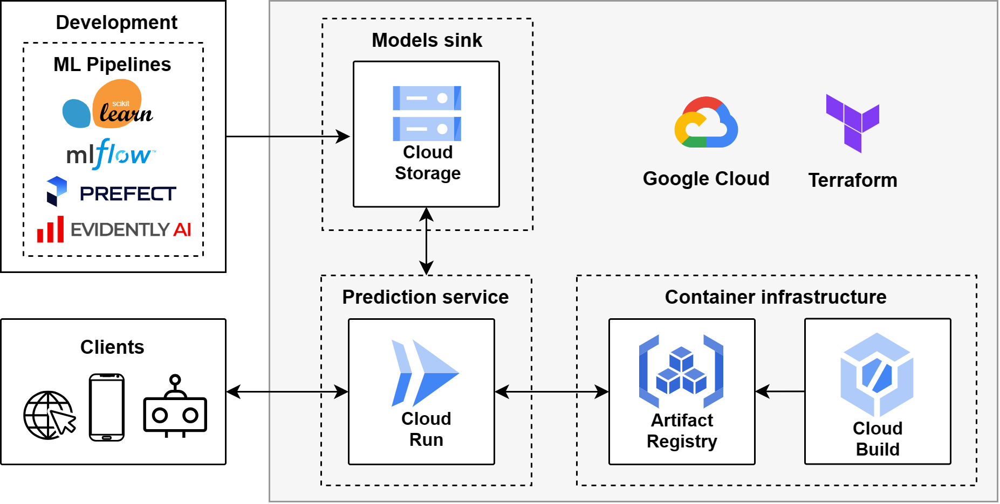

# MLOps project - course from DataTalksClub

Online web service for prediction of duration taxi ride based on public datasets provided by the New York City Taxi & Limousine Commission - TLC regarding taxi trips.

Test online service by using simple web page at root home from Cloud Run service URL: https://rides-ucpkfmi6pq-ue.a.run.app/

Test online service through command line:
```bash
URL=https://rides-ucpkfmi6pq-ue.a.run.app/predict  # Cloud Run service URL
curl -X POST \
    -H 'Content-type: application/json' \
    -d '{"PULocationID": 43, "DOLocationID": 151, "trip_distance": 1.01}' \
    "${URL}"
```

General technical implementation descriptions:
- The model is developed as a scikit-learn pipeline for preprocessing and using a linear regression model, experiment tracking is performed through MLflow, and model registry is accomplished through MLflow and Google Cloud Storage as models sink. This development stage is performed through Prefect orchestrator for accessing datasets and training model. The configuration of Evidently AI along with metrics database has been setup for model building pipeline.
- The prediction service is deployed to Google Cloud where Cloud Build along with Artifact Registry are used to containerize the service and Cloud Run is used as execution environment for exposing as web service through Flask framework and MLflow to access models registry sink.
- All cloud resources are provisioned using Terraform and most reproducibility steps are automated with Bash scripts.



## Up and running (reproducibility)

### Cloud resources
Pre-requisites:
- Unix-like system with following cli tools: bash, gcloud, jq, terraform

Provision cloud infrastructure on existing Google Cloud project:
- if using [Cloud Shell](https://console.cloud.google.com/?cloudshell=true):
    ```bash
    make terraform_apply
    ```
- if using other than [Cloud Shell](https://console.cloud.google.com/?cloudshell=true):
    ```bash
    gcloud auth application-default login

    GCP_PROJECT_ID=
    gcloud config set project "${GCP_PROJECT_ID}"

    make terraform_apply
    ```

Share `output.json` file at [infra/gcp/terraform/](infra/gcp/terraform/) if using other computer/instance for development, this enables development with no direct access to Terraform state. Copy to same location in development.

### Development
Pre-requisites:
- Unix-like system with following cli tools: bash, gcloud, jq
- Docker Compose (for development only)
- Python>=3.8 distribution

Setup access to Google Cloud if missing:
```bash
gcloud auth application-default login

GCP_PROJECT_ID=
gcloud config set project "${GCP_PROJECT_ID}"
```

MLflow server:
- create virtual environment and check more server options at [infra/local/README.md](infra/local/README.md)
```bash
make mlflow_server
```

Metrics database and Prefect server:
```
make compose_up
```

Run ML pipelines:
- [analytics/ml-pipelines/duration/README.md](./analytics/ml-pipelines/duration/README.md)

Deploy web service to Cloud Run: [services/rides/README.md](./services/rides/README.md)
```bash
export MLFLOW_MODEL_URI=
export MLFLOW_MODEL_VERSION=
export REGION=us-east1
make rides_build_deploy
```

Test service:
```bash
URL=  # Cloud Run service URL
curl -X POST \
    -H 'Content-type: application/json' \
    -d '{"PULocationID": 43, "DOLocationID": 151, "trip_distance": 1.01}' \
    "${URL}"
```
